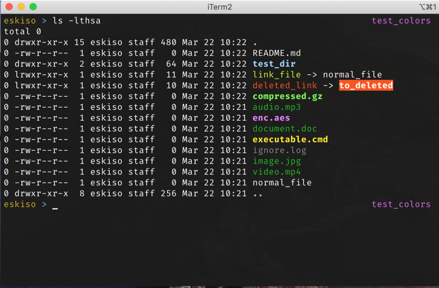

# Eskiso dotfiles

**Shell**: [Zshell](https://www.zsh.org/) (with [Oh My ZSH](https://ohmyz.sh/))

**Theme**: [Typewritten](https://github.com/reobin/typewritten)

**Font**:  [FiraMono](https://github.com/powerline/fonts/tree/master/FiraMono)

**Emulator**: Windows Terminal (Preview)

*Notice that at this moment **Windows Terminal (Preview)** does not show **bold** correctly so **ls** image is missing that on the screenshot, but it is there*

## macOS

*screenshot pending update*

**Make sure you have coreutils installed**

`brew install coreutils`

Change last line on .zshrc
