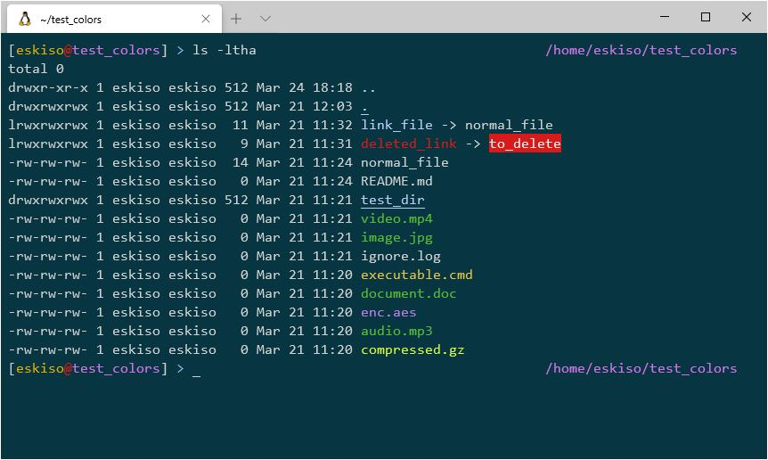

# Eskiso dotfiles

**Shell**: [Zshell](https://www.zsh.org/) (with [Oh My ZSH](https://ohmyz.sh/))
**Theme**: [SpaceCamp](https://github.com/jaredgorski/SpaceCamp)
**Font**:  [FiraMono](https://github.com/powerline/fonts/tree/master/FiraMono)
**Emulator**: Windows Terminal (Preview)

*Notice that at this moment Windows Terminal (Preview) does not show **bold** correctly so **ls** image is missing that on the screenshot, but it is there*
